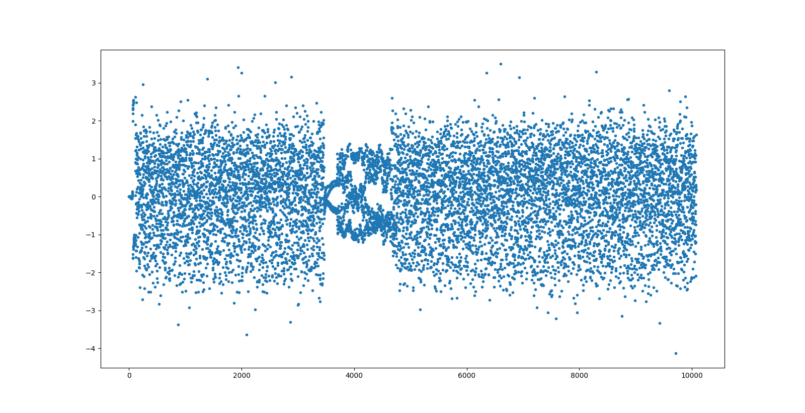
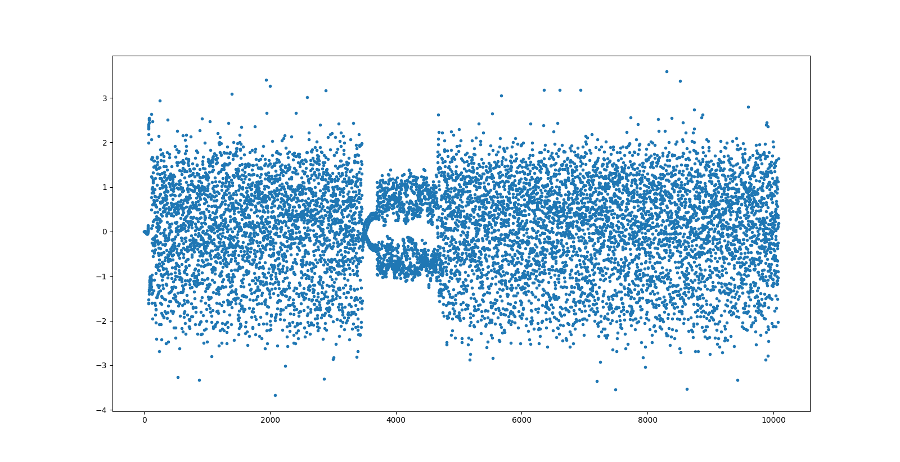

.. _gr_satellites command line tool:

gr_satellites command line tool
===============================

The ``gr_satellites`` command line tool is a complete solution that can decode
frames using either real-time RF samples from an SDR or conventional radio, or a
recording.

Basic usage
^^^^^^^^^^^

``gr_satellites`` can be run from a terminal after gr-satellites has been
installed. If run without any arguments, ``gr_satellites`` will only print some
basic information about the arguments it allows.

.. code-block:: console

   $ gr_satellites 
   usage: gr_satellites satellite [-h] [--wavfile WAVFILE] [--rawfile RAWFILE]
		                  [--rawint16 RAWINT16] [--samp_rate SAMP_RATE]
                                  [--udp] [--udp_ip UDP_IP] [--udp_port UDP_PORT]
                                  [--kiss_in KISS_IN] [--iq]
                                  [--input_gain INPUT_GAIN] [--kiss_out KISS_OUT]
                                  [--kiss_append] [--hexdump]
                                  [--dump_path DUMP_PATH]

.. _Specifying the satellite:

Specifying the satellite
""""""""""""""""""""""""

The arguments that ``gr_satellites`` allows depend on the satellite that has
been selected. Therefore, to use ``gr_satellites`` it is always necessary to
specify the ``satellite`` to be used as an argument immediately following
``gr_satellites``. There are three different ways to specify the satellite:

* Using the satellite name, such as *FUNcube-1* or *LilacSat-2*. This can be
  used with any :ref:`satellite officially supported by gr-satellites<Supported
  satellites>`, and it is the most simple way of specifying a satellite.

  .. code-block:: console

     $ gr_satellites FUNcube-1
     Need to specify exactly one of the following input sources: {--wavfile, --rawfile, --rawint16, --udp, --kiss_in}
     usage: gr_satellites satellite [-h] [--wavfile WAVFILE] [--rawfile RAWFILE]
                                    [--rawint16 RAWINT16] [--samp_rate SAMP_RATE]
                                    [--udp] [--udp_ip UDP_IP] [--udp_port UDP_PORT]
                                    [--kiss_in KISS_IN] [--iq]
                                    [--input_gain INPUT_GAIN] [--kiss_out KISS_OUT]
                                    [--kiss_append] [--hexdump]
                                    [--dump_path DUMP_PATH] [--f_offset F_OFFSET]
                                    [--rrc_alpha RRC_ALPHA] [--disable_fll]
                                    [--fll_bw FLL_BW] [--clk_bw CLK_BW]
                                    [--clk_limit CLK_LIMIT] [--costas_bw COSTAS_BW]
                                    [--manchester_history MANCHESTER_HISTORY]
                                    [--syncword_threshold SYNCWORD_THRESHOLD]
                                    [--verbose_rs]

 A satellite may have several different names, known as *alternative
 names*. For example, FUNcube-1 is both known as AO-73 and FUNcube-1.
				    
* Using the satellite `NORAD ID`_. This can bue used with any
  :ref:`satellite officially supported by gr-satellites<Supported satellites>`,
  and it can be useful when interfacing ``gr_satellites`` with other tools that
  use NORAD IDs to classify satellites.

  Below we show ``gr_satellites`` running with NORAD ID 39444, which corresponds
  to FUNcube-1.

  .. code-block:: console

     $ gr_satellites 39444
     Need to specify exactly one of the following input sources: {--wavfile, --rawfile, --rawint16, --udp, --kiss_in}
     usage: gr_satellites satellite [-h] [--wavfile WAVFILE] [--rawfile RAWFILE]
                                    [--rawint16 RAWINT16] [--samp_rate SAMP_RATE]
                                    [--udp] [--udp_ip UDP_IP] [--udp_port UDP_PORT]
                                    [--kiss_in KISS_IN] [--iq]
                                    [--input_gain INPUT_GAIN] [--kiss_out KISS_OUT]
                                    [--kiss_append] [--hexdump]
                                    [--dump_path DUMP_PATH] [--f_offset F_OFFSET]
                                    [--rrc_alpha RRC_ALPHA] [--disable_fll]
                                    [--fll_bw FLL_BW] [--clk_bw CLK_BW]
                                    [--clk_limit CLK_LIMIT] [--costas_bw COSTAS_BW]
                                    [--manchester_history MANCHESTER_HISTORY]
                                    [--syncword_threshold SYNCWORD_THRESHOLD]
                                    [--verbose_rs]
  
* Using a path to an ``.yml`` SatYAML file. SatYAML files are used by
  gr-satellites to specify the decoding parameters and configuration
  corresponding to each different satellite. They are described in more detail
  in the :ref:`SatYAML files` section.

  gr-satellites comes bundled with a large number of SatYAML files corresponding to all
  the officially supported satellites. They can be found in the
  ``python/satyaml/`` directory.

  Specifying the path of a SatYAML file is useful if the user has modified some
  of the files bundled with gr-satellites or has created their own ones.

    .. code-block:: console

     $ gr_satellites python/satyaml/AO-73.yml
     Need to specify exactly one of the following input sources: {--wavfile, --rawfile, --rawint16, --udp, --kiss_in}
     usage: gr_satellites satellite [-h] [--wavfile WAVFILE] [--rawfile RAWFILE]
                                    [--rawint16 RAWINT16] [--samp_rate SAMP_RATE]
                                    [--udp] [--udp_ip UDP_IP] [--udp_port UDP_PORT]
                                    [--kiss_in KISS_IN] [--iq]
                                    [--input_gain INPUT_GAIN] [--kiss_out KISS_OUT]
                                    [--kiss_append] [--hexdump]
                                    [--dump_path DUMP_PATH] [--f_offset F_OFFSET]
                                    [--rrc_alpha RRC_ALPHA] [--disable_fll]
                                    [--fll_bw FLL_BW] [--clk_bw CLK_BW]
                                    [--clk_limit CLK_LIMIT] [--costas_bw COSTAS_BW]
                                    [--manchester_history MANCHESTER_HISTORY]
                                    [--syncword_threshold SYNCWORD_THRESHOLD]
                                    [--verbose_rs]
				    
.. _NORAD ID: https://en.wikipedia.org/wiki/Satellite_Catalog_Number

.. _Specifying the input source:

Specifying the input source
"""""""""""""""""""""""""""

Besides specifying the satellite to use for decoding, it is mandatory to specify
the input source by using exactly one of the following options:

* ``--wavfile`` can be used to read a recording in WAV format. The sample rate
  of the recording needs to be specified with the ``--samp_rate`` argument.

  By default, the WAV file is interpreted as a one-channel file containing real
  RF samples. To read a two-channel file containing IQ RF samples, the ``--iq``
  argument needs to be specified.

  .. note::
     All the :ref:`sample recordings <Downloading sample recordings>` in
     the ``satellite-recordings/`` are real 48kHz WAV files and can be read with
     the ``--wavfile file --samp_rate 48e3`` arguments.

     For example, this will decode some frames from FUNcube-1:
     
     .. code-block:: console

        $ gr_satellites FUNcube-1 --wavfile satellite-recordings/ao73.wav --samp_rate 48e3
  
* ``--rawfile`` can be used to read a recording in ``complex64`` or ``float32``
  format (depending on whether the ``--iq`` argument is used or not). The sample rate
  of the recording needs to be specified with the ``--samp_rate`` argument.

  .. note::
     Files in ``complex64`` format contain a sequence of 32-bit floating point numbers in
     IEEE 754 format. The sequence alternates between the I (in-phase) and Q
     (quadrature) componentes of a stream of IQ samples. This format is used by the
     GNU Radio File Source and File Sink blocks when their type is set to
     *complex*.

     Files in ``float32`` format contain a sequence of 32-bit floating point
     numbers in IEEE 754 format. The sequence contains the elements of a stream
     of real samples. This format is used by the GNU Radio File Source and File
     Sink blocks when their type is set to *float*.

* ``--rawint16`` can be used to read a recording in ``int16`` format. The file
  is interpreted as IQ or real data according as to whether the ``--iq``
  argument is used or not.  The sample rate of the recording needs to be
  specified with the ``--samp_rate`` argument.

  .. note::
     Files in ``int16`` format contain a sequence of 16-bit integers in
     host endianness. This format is used by GNU Radio File Source and File Sink
     blocks when their type is set to *short*.

* ``--udp`` can be used to received RF samples streamed in real-time. The sample rate
  of the recording needs to be specified with the ``--samp_rate`` argument.

  The streaming format is the same as for the ``--rawint16`` and both real
  samples (by default) and IQ samples (using the ``--iq`` argument) are
  supported.

  By default, ``gr_satellites`` will listen on the IP address ``::`` (all
  addresses) and the UDP port 7355. A different IP address or port can be
  specified using the parameters ``--udp_ip`` and ``--udp_port``.

  .. note::
     `GQRX`_ can stream audio in UDP using this format and UDP port,
     and a sample rate of 48ksps by following the instructions
     `here <https://gqrx.dk/doc/streaming-audio-over-udp>`_. In this case,
     ``gr_satellites`` should be run as

     .. code-block:: console

	$ gr_satellites FUNcube-1 --udp --samp_rate 48e3

     This is recommended as a simple way of interfacing ``gr_satellites`` with
     SDR hardware for beginner users.

     It is also possible to use the example GNU Radio companion flographs in
     `gr-frontends`_ to stream samples by UDP from different sources.

     For more advanced users, ``nc`` can also be a very useful tool for streaming.

* ``--kiss_in`` can be used to process a file containing already decoded frames
  in KISS format. All the demodulation steps are skipped and only telemetry
  parsing, file receiving, etc. are done.

  This can be useful to view the telemetry stored in files previously decoded
  with gr-satellites or other software.

Getting help
""""""""""""

``gr_satellites`` prints a detailed description of all the allowed arguments by
using the ``-h`` or ``--help`` argument. Note that a satellite needs to be
specified, since the set of allowed arguments depends on the decoders used by
that satellite.

For example, this shows all the options allowed by the FUNcube-1 decoder:

.. code-block:: console

   $ gr_satellites FUNcube-1 --help
   usage: gr_satellites satellite [-h] [--wavfile WAVFILE] [--rawfile RAWFILE]
                                  [--rawint16 RAWINT16] [--samp_rate SAMP_RATE]
                                  [--udp] [--udp_ip UDP_IP] [--udp_port UDP_PORT]
                                  [--kiss_in KISS_IN] [--iq]
                                  [--input_gain INPUT_GAIN] [--kiss_out KISS_OUT]
                                  [--kiss_append] [--hexdump]
                                  [--dump_path DUMP_PATH] [--f_offset F_OFFSET]
                                  [--rrc_alpha RRC_ALPHA] [--disable_fll]
                                  [--fll_bw FLL_BW] [--clk_bw CLK_BW]
                                  [--clk_limit CLK_LIMIT] [--costas_bw COSTAS_BW]
                                  [--manchester_history MANCHESTER_HISTORY]
                                  [--syncword_threshold SYNCWORD_THRESHOLD]
                                  [--verbose_rs]

   gr-satellites - GNU Radio decoders for Amateur satellites

   optional arguments:
     -h, --help            show this help message and exit

   input:
     --wavfile WAVFILE     WAV input file
     --rawfile RAWFILE     RAW input file (float32 or complex64)
     --rawint16 RAWINT16   RAW input file (int16)
     --samp_rate SAMP_RATE
                        Sample rate (Hz)
     --udp                 Use UDP input
     --udp_ip UDP_IP       UDP input listen IP [default='::']
     --udp_port UDP_PORT   UDP input listen port [default='7355']
     --kiss_in KISS_IN     KISS input file
     --iq                  Use IQ input
     --input_gain INPUT_GAIN
                        Input gain (can be negative to invert signal)
                        [default=1]

   output:
     --kiss_out KISS_OUT   KISS output file
     --kiss_append         Append to KISS output file
     --hexdump             Hexdump instead of telemetry parse
     --dump_path DUMP_PATH
                           Path to dump internal signals

   demodulation:
     --f_offset F_OFFSET   Frequency offset (Hz) [default=1500 or 12000]
     --rrc_alpha RRC_ALPHA
                           RRC roll-off (Hz) [default=0.35]
     --disable_fll         Disable FLL
     --fll_bw FLL_BW       FLL bandwidth (Hz) [default=25]
     --clk_bw CLK_BW       Clock recovery bandwidth (relative to baudrate)
                           [default=0.06]
     --clk_limit CLK_LIMIT
                           Clock recovery limit (relative to baudrate)
                           [default=0.02]
     --costas_bw COSTAS_BW
                           Costas loop bandwidth (Hz) [default=50]
     --manchester_history MANCHESTER_HISTORY
                           Manchester recovery history (symbols) [default=32]

   deframing:
     --syncword_threshold SYNCWORD_THRESHOLD
                           Syncword bit errors [default=8]
     --verbose_rs          Verbose RS decoder

   The satellite parameter can be specified using name, NORAD ID or path to YAML
   file

.. _Output:

Output
""""""

By default, ``gr_satellites`` will "do its best" to show the user the output
for the decoded frames. If the telemetry format for the satellite is implemented
in gr-satellites, the telemetry frames will be printed to the standard output in
human-readable format. Otherwise, the raw frames will be printed out in hex
format to the standard output.

File decoding, image decoding and other special output options of some
particular satellites are enabled by default.

Customization of the ouput options is described in the :ref:`Output options`
subsection below.

Examples
""""""""

The ``test.sh`` script in the ``gr-satellites/`` directory runs
``gr_satellites`` on several of the
:ref:`sample recordings <Downloading sample recordings>` in
``satellite-recordings/``. This script can be used as a series of examples of
how to run ``gr_satellites``.

.. _Output options:

Ouput options
^^^^^^^^^^^^^

This subsection explains in detail the different output options that can be used
with the ``gr_satellites`` command line tool. The default behaviour when no
options are specified has been described in the :ref:`Output` subsection above.

.. _Hex dump:

Hex dump
""""""""

By using the option ``--hexdump``, it is possible to make ``gr_satellites``
print the received frames in hexadecimal format, regardless of whether there is
a telemetry decoder available or not. The format used to print the frames is the
same as used by the GNU Radio block `Message Debug`_ ``print_pdu`` input.

An example of the use of this option can be seen here:

.. code-block:: console

    $ gr_satellites FUNcube-1 --wavfile ~/gr-satellites/satellite-recordings/ao73.wav \
             --samp_rate 48e3 --hexdump
    * MESSAGE DEBUG PRINT PDU VERBOSE *
    ()
    pdu_length = 256
    contents = 
    0000: 89 00 00 00 00 00 00 00 00 1f cc 00 ce 02 d1 00 
    0010: 00 07 08 09 09 00 00 05 01 01 00 40 13 2f c8 f2 
    0020: 5c 8f 34 23 f3 ba 0b 5d 62 74 51 c7 ea fa 69 4a 
    0030: 9a 9f 00 09 ef a0 1f f4 a7 ea 4a c6 8f 11 40 11 
    0040: 1e 10 f7 01 3e 20 64 00 d7 8b f8 d7 94 c8 93 a8 
    0050: 2a da 52 a6 0e 58 0e c8 0f 4e 01 1d 20 5a 00 db 
    0060: 94 a8 aa 8a 98 13 ac 69 0a a6 a8 10 e6 10 92 0f 
    0070: b8 01 50 20 64 00 d7 96 a8 c1 8b 48 25 ab a9 ca 
    0080: ce 9d 10 76 0f c9 10 55 01 3a 20 5a 00 d7 97 29 
    0090: 08 8c 48 4f a9 6a 5a f2 a4 10 39 0f 7b 0f 86 01 
    00a0: 49 20 64 00 d7 94 08 d0 8a d8 2a ad 6a 5a 7e b4 
    00b0: 0e 53 0e 9b 0e b7 01 09 20 5a 00 db 99 a8 f2 8f 
    00c0: e8 38 af aa 8a c2 9e 0e de 0f 48 0e 31 01 31 20 
    00d0: 5a 00 ce 9b c8 ff 88 68 1b b2 6a 5a ca a7 0f c3 
    00e0: 0e 74 0e 58 01 34 20 5a 00 d7 9b 39 1b 97 b8 c5 
    00f0: b0 2b 3a d6 b5 01 6b 00 6a 02 9e 00 03 20 13 00 
    ***********************************

KISS output
"""""""""""

Decoded frames can be saved to a file in `KISS format`_. This is a simple format
that serves to delimit frames stored in a file or sent over a serial bus, and it
is frequently used to store telemetry frames.

To enable KISS output, the ``--kiss_out`` parameter followed by the path of the
output file should be used. By default ``gr_satellites`` will overwrite the
file if it already exists. To append to the file instead, the option
``--kiss_append`` can be used in addition to the ``--kiss_out``
option. Appending can be used to concatenate frames obtained in several decoding
runs.

Files in KISS format can be read with ``gr_satellites`` as indicated above or
with other software tools.

Telemetry output
""""""""""""""""

For satellites supporting telemetry parsing, ``gr_satellites`` will default to
printing the decoded telemetry values to the standard output. It is possible to
write these messages to a file instead by using the ``--telemetry_output``
parameter followed by the path of the output file.

Dump internal signals
"""""""""""""""""""""

For advanced users and developers, the demodulators used in ``gr_satellites``
can dump the internal signals used inside the demodulator. This option can be
enabled by using the ``--dump_path`` parameter followed by a path to the
directory where the different files are created. It is recommended to use this
option with a short recording, to avoid creating very large files. The details
of each of these files are best studied in the Python source code of the
demodulators (see ``python/components/demodulators/``).

The following example show how to use ``--dump_path`` to plot the symbols with
`Numpy`_ and `Matplotlib`_ and optimize the decoding parameters for a particular
recording. We first run the following to dump to the path ``/tmp/fsk`` the
internal signals produced by decoding a sample recording of AU02.

.. code-block:: console

    $ mkdir -p /tmp/fsk
    $ gr_satellites AU02 --wavfile satellite-recordings/au02.wav \
         --samp_rate 48e3 --dump_path /tmp/fsk

We see that we do not get any decoded packets. Then, we can plot the FSK symbols
with the following Python code:

.. code-block:: python

     import numpy as np
     import matplotlib.pyplot as plt

     x = np.fromfile('/tmp/fsk/clock_recovery_out.f32', dtype = 'float32')
     plt.plot(x, '.')
     plt.show()

This produces the figure below, which shows that there has been a clock cycle
slip mid packet, which prevents correct decoding.

    FSK symbols with default parameters

We can run ``gr_satellites`` again adding the parameter ``--clk_bw 0.1`` to
increase the clock recovery loop bandwidth. With this parameter we get a
successful decode and if we plot the FSK symbols again, we get the figure below,
which shows that the clock recovery is working much better than before.

    FSK symbols with non-default parameters

.. _Telemetry submission:

Telemetry submission
^^^^^^^^^^^^^^^^^^^^

The ``gr_satellites`` command line tool can be used to submit decoded telemetry
to an online database server, such as `SatNOGS DB`_ and these others servers used by
certain satellite projects:

* `FUNcube Warehouse`_, which is used by the FUNcube payloads on FUNcube-1, UKube-1,
  Nayif-1 and JY1Sat.

* `PW-Sat2 Groundstation`_, which is used by PW-Sat2.

* The `BME telemetry server`_, which is used by SMOG-P, ATL-1 and SMOG-1.

To enable telemetry submission, it is necessary to edit some parameters in
``gr_satellites``'s config file, which is located in
``~/.gr_satellites/config.ini``. If this file does not exist, it will be created
with a template when ``gr_satellites`` is first run. The template looks like
this:

.. code-block::

    [Groundstation]
    callsign = 
    latitude = 0
    longitude = 0
    submit_tlm = no

    [FUNcube]
    site_id = 
    auth_code = 

    [PW-Sat2]
    credentials_file = 

    [BME]
    user =
    password =

To enable telemetry submission, the ``submit_tlm`` parameter must be set to
``yes``. Additionally, the receiving stations ``callsign`` as well as its
location (``latitude`` and ``longitude``) need to be set, since some of the
servers need these parameters. Once this is done, telemetry submission to
SatNOGS DB will be enabled for all satellites.

To enable telemetry submission to the FUNcube warehouse, it is necessary to fill
in the ``site_id`` and ``auth_code``. These can be obtained by
`registering in the warehouse`_.

To enable telemetry submission to the PW-Sat2 server, it is necessary to enter
the path to the credentials file in the ``credentials_file`` parameter. This
file is a JSON file that is generated and downloaded in the
"`Your credentials`_" section of the server web interface. It is necessary to
have an account registered in the server to obtain the credentials file.

To enable telemetry submission to the BME server, it is necessary to
`register an account in the BME server`_. The user and password should be
entered into the gr-satellites ``.ini`` file.

For some telemetry servers, including SatNOGS DB, the frames are submitted
together with a timestamp of reception. This timestamp is taken from the
computer's clock by ``gr_satellites`` at the moment when it decodes the
frame. This means that, in order to use telemetry submission appropriately, the
computer's clock should be set accurately and a live signal rather than a
recording should be decoded.

File and image receiver
^^^^^^^^^^^^^^^^^^^^^^^

Some satellites transmit files (especially image files) by splitting the files
into many telemetry packets. The ``gr_satellites`` decoder supports reassembling
and storing these files into a directory. Additionally, image files are automatically
displayed in real time as they are being received, using `feh`_.

Currently the satellites that have decoders supporting file reception are ATL-1
and SMOG-P (they transmit RF spectrum data), and the satellites that have
decoders supporting image reception are 1KUNS-PF, BY70-1, D-SAT, LilacSat-1 and
Światowid.

For satellites supporting file reception, the ``--file_output_path`` parameter
can be used to set the directory that is used to store received files. The
filenames of the received files will be automatically created using metadata or
a counter (if no metadata is transmitted). By default, received files are stored
in ``/tmp/``.

The ``--verbose_file_receiver`` parameter can be used to enable additional
debugging information about the functionality of the file receiver.

Other topics
^^^^^^^^^^^^

This subsection deals with other topics which are relevant to the usage of ``gr_satellites``.

.. _Real or IQ input:

Real or IQ input
""""""""""""""""

The ``gr_satellites`` command line tool supports both real (one-channel) input
and IQ input (which consists of two channels: in-phase and quadrature). A
detailed description of these two ways to represent a signal is out of the scope
of this document. This subsection gives some practical advice regarding the
difference between real and IQ input.

By default ``gr_satellites`` will assume that its input is real. To use IQ
input, the ``--iq`` option must be used.

When using the audio output of either a conventional radio or an SDR software
performing SSB or FM demodulation, ``gr_satellites`` should be used with the
real input option. Likewise, recordings produced from this kind of audio output, such
as one-channel WAV recordings should also be used with the real input option.

However, most SDR softwares will also have an option to save raw samples to a
file. These files are almost always IQ, and can be either a two-channel WAV file
or a file in raw format. The IQ input option must be used when using
``gr_satellites`` to read these files. Additionally, some
SDR software may support streaming IQ data by UDP. This can also be used in
``gr_satellites`` with the IQ input option.

.. _FSK demodulation and IQ input:

FSK demodulation and IQ input
"""""""""""""""""""""""""""""

When using an AFSK or FSK demodulator, the usage of the ``--iq`` option has an
additional effect. Since (A)FSK is a mode based on frequency modulation, it is
common to use either a conventional FM radio or an SDR software performing FM
demodulation to receive (A)FSK. Audio recordings obtained in this manner are also
common. Therefore, when ``gr_satellites`` is run without the ``--iq`` signal, it
will expect that (A)FSK signals have already been FM-demodulated in this way.

When the ``--iq`` option is used, ``gr_satellites`` expects an (A)FSK signal that
has not been FM-demodulated, and so it will perform FM-demodulation first. This
is the kind of procedure that should be employed with inputs such as raw IQ
recordings of an SDR, since the (A)FSK signals present in this kind of recordings
have not been FM-demodulated.

.. note::
   The output of the radio or SDR software when running in FM mode to
   receive an FSK signal is actually an NRZ signal. Therefore, when
   ``gr_satellites`` is run without the ``--iq`` option, it will expect an NRZ
   signal instead of an FSK signal. When ``gr_satellites`` is run with the ``--iq``
   option, it will expect an FSK signal.

   Similarly, the output of the radio or SDR software when running in FM mode to
   receive an AFSK signal is actually an audio-frequency FSK signal. Therefore,
   when ``gr_satellites`` is run without the ``--iq`` option, it will expect an
   audio-frequency FSK signal instead of an AFSK signal. When ``gr_satellites``
   is run with the ``--iq`` option, it will expect an AFSK signal.

   Note that this behaviour is what the user wants in most cases, but it also
   means that it is not possible to run ``gr_satellites`` directly on an (A)FSK signal which
   is represented in intermediate frequency as a real signal.

.. _Frequency offsets for BPSK:
   
Frequency offsets for BPSK
""""""""""""""""""""""""""

A usual way of receiving a BPSK signal is to use either a conventional radio or
an SDR software in SSB mode (USB mode, normally) and tune the BPSK signal in the
middle of the audio passband. Audio recordings obtained in this manner are also
common.

.. note::
   The SSB filter of a conventional radio is often approximately 3kHz
   wide. For this reason, only BPSK signals with a baudrate of 2400 baud or
   lower can be received with a conventional SSB radio. For BPSK signals with larger
   baudrate, an SDR receiver should be used.

The ``gr_satellites`` command line tool needs to know the frequency at which the
BPSK signal is tuned within the audio passband. If necessary, this can be specified with the
``--f_offset`` parameter, followed by the frequency in Hz. There are the
following defaults:

* For signals with a baudrate of 2400 baud or less, a frequency offset of 1500
  Hz is used. This follows the common practice of using a regular 3kHz SSB
  bandwidth and tuning the signal in the middle of the passband.
  
* For signals with a baudrate larger than 2400, a frequency offset of 12000 Hz
  is used. The rationale is that, for best results, a passband of 24000 Hz
  should be used, since this is the
  largest that fits in a 48kHz audio signal, and the signal should be tuned in
  the middle of this 24000 Hz passband. This kind of usage is sometimes called
  "wide SSB mode".

These settings only apply for a real input. When ``gr_satellites`` is used with
IQ input, the default is to expect the BPSK signal tuned at 0Hz (i.e., at
baseband). A different frequency can still be selected with the ``--f_offset``
parameter.

FSK signal polarity
"""""""""""""""""""

A conventional FM radio, or even an SDR software running in FM mode might invert
the polarity of the output signal, since the polarity is not relevant for audio
signals. However, the polarity is relevant when receiving an FSK signal that
does not use differential coding.

An input with the inverted polarity will cause decoding to fail. In this case,
the input can be inverted again by using the ``--input_gain -1`` parameter,
which has the effect of multiplying the input signal by -1 before it is
processed, thus restoring the correct polarity.

.. _GQRX: https://gqrx.dk/
.. _gr-frontends: https://github.com/daniestevez/gr-frontends
.. _Message Debug: https://wiki.gnuradio.org/index.php/Message_Debug
.. _KISS format: http://www.ax25.net/kiss.aspx
.. _SatNOGS DB: https://db.satnogs.org/
.. _FUNcube Warehouse: http://warehouse.funcube.org.uk/
.. _PW-Sat2 Groundstation: https://radio.pw-sat.pl/
.. _BME telemetry server: https://gnd.bme.hu:8080/
.. _registering in the warehouse: http://warehouse.funcube.org.uk/registration
.. _Your credentials: https://radio.pw-sat.pl/communication/yourcredentials
.. _register an account in the BME server: https://gnd.bme.hu:8080/auth/register
.. _feh: https://feh.finalrewind.org/
.. _NumPy: https://numpy.org/
.. _Matplotlib: https://matplotlib.org/
