.. _Components:

Components
==========

Components represent gr-satellite's way of decomposing the decoding process in
high-level blocks. The decoding chain is broken into a series of steps which
pass their output to the input of the next step. These are the following:

* **Data sources**. These produce the input of the decoding chain, which
  typically consists of RF signal samples.

* **Demodulators**. These turn RF samples into soft symbols. They filter the
  signal, recover the transmit clock and carrier if necessary, etc. An example
  is a BPSK demodulator, which turns RF samples of a BPSK signal into a stream
  of soft symbols.

* **Deframers**. Deframers implement the lower layer protocols related to frame
  boundary detection, descrambling, deinterleaving, FEC, error checking with a
  CRC code, etc. The output of a deframer are PDUs with the frames. An example
  is an AX.25 deframer, or a CCSDS concatenated code deframer.

* **Transports**. Transports implement higher layer protocols that might be
  needed to get to the useful information inside the frames. For example, if
  frames are fragmented, a transport will handle defragmentation. An example is
  a KISS transport, whose input are frames that contain bytes of a KISS stream,
  and its output are the packets contained in that KISS stream, regardless of
  how they are split between different frames.

* **Data sinks**. Data sinks are the consumers of packets. They might store
  them, send them to another software, or parse telemetry values.

Below, the main component blocks in each category are described.

Data sources
^^^^^^^^^^^^

Data source components can be found under *Satellites > Data sources* in GNU
Radio companion. Currently, the only data source is the "KISS File Source"
block. This block will read a file in KISS format, and output the frames in the
file as PDUs.

The usual operations involving reading RF samples from an SDR or recording can
be achieved easily with default GNU Radio blocks, so there are no specific data
sources for these. Advanced users can look at the ``setup_input()`` method of
the class ``gr_satellites_top_block`` in ``apps/gr_satellites`` to see how the
``gr_satellites`` command line tools sets up its different inputs using default
GNU Radio blocks.

Demodulators
^^^^^^^^^^^^

Demodulator components can be found under *Satellites > Demodulators* in GNU
Radio companion. There are currently three demodulator component block:

* BPSK demodulator

* FSK demodulator

* AFSK demodulator

They take RF signal samples as input, and output soft symbols, as a stream of
``float`` normalized with amplitude one. The input can be either real or IQ
(complex). See :ref:`Real or IQ input` for more information.

The demodulator blocks and their parameters are described below.

BPSK demodulator
""""""""""""""""

The BPSK demodulator expects an input which consists of RF samples of a BPSK
signal, and outputs the demodulated BPSK soft symbols. The BPSK signal can
optionally be DBPSK or Manchester encoded.

The figure below shows the example flowgraph which can be found in
``examples/components/bpsk_demodulator.grc``. This reads a WAV file from
:ref:`satellite-recordings<Downloading sample recordings>` which contains some
BPSK packets from LilacSat-1 and uses the BPSK demodulator to obtain the
symbols. The "Skip Head" and "Head" blocks are used to select a portion of the
output, which is then plotted using the "QT GUI Time Sink".

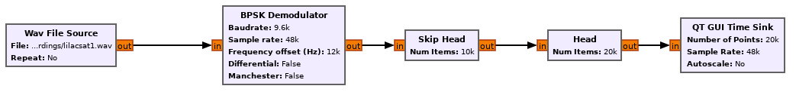

    Usage of BPSK demodulator in a flowgraph

When this example flowgraph is run, it displays the output shown in the figure
below. There we can see the start of the BPSK packet. On the left side of the
plot we have noise, before the packet starts, then the packet starts, and the
clock and carrier recovery take some time to sync. After this, then symbols are
demodulated properly. This can be seen because the +1 and -1 symbols are well
separated.
    
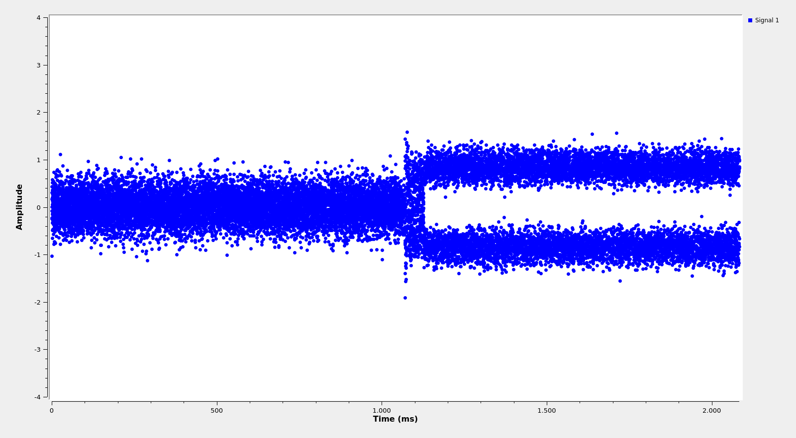

    Output of the BPSK demodulator example flowgraph

The figure below shows the options allowed by the BPSK demodulator block. The
Baudrate option is used to set the baudrate in symbols per second. The Sample
rate option specifies the sample rate of the input. The Frequency offset
specifies at which frequency the BPSK signal is centred
(see :ref:`Frequency offsets for BPSK`).

The Differential option enables differential decoding of DBPSK. For differential
decoding, the phase recovery using a Costas loop is disabled and non-coherent
demodulation is used.

The Manchester option enables Manchester decoding. A Manchester encoded BPSK
signal is decoded as if it had twice the baudrate, and then the phase of the
Manchester clock is searched in the symbols and the Manchester clock is
"wiped-off", multiplying symbols by the clock and accumulating them by pairs.

The IQ input option enables IQ (complex) input.
    
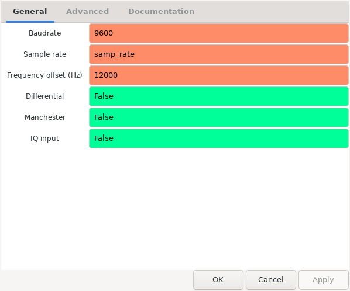

    Options of BPSK demodulator
    
FSK demodulator
"""""""""""""""

The FSK demodulator expects an input which consists of RF samples of an FSK
signal, and outputs the demodulated FSK soft symbols. Both real and IQ (complex)
input are suported, but the semantics are different: with real input, the FSK
demodulator expects an FM-demodulated signal; with IQ input, the FSK demodulator
expects the signal before FM demodulation
(see :ref:`FSK demodulation and IQ input`).

The figure below shows the example flowgraph which can be found in
``examples/components/fsk_demodulator.grc``. This reads a WAV file from
:ref:`satellite-recordings<Downloading sample recordings>` which contains a single
FSK packets from AAUSAT-4 and uses the FSK demodulator to obtain the
symbols. The is plotted using the "QT GUI Time Sink".

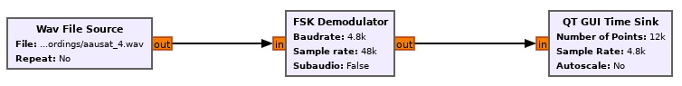

    Usage of FSK demodulator in a flowgraph

When this example flowgraph is run, it displays the output shown in the figure
below. There we can see the FSK packet, surrounded by noise on both sides.
    
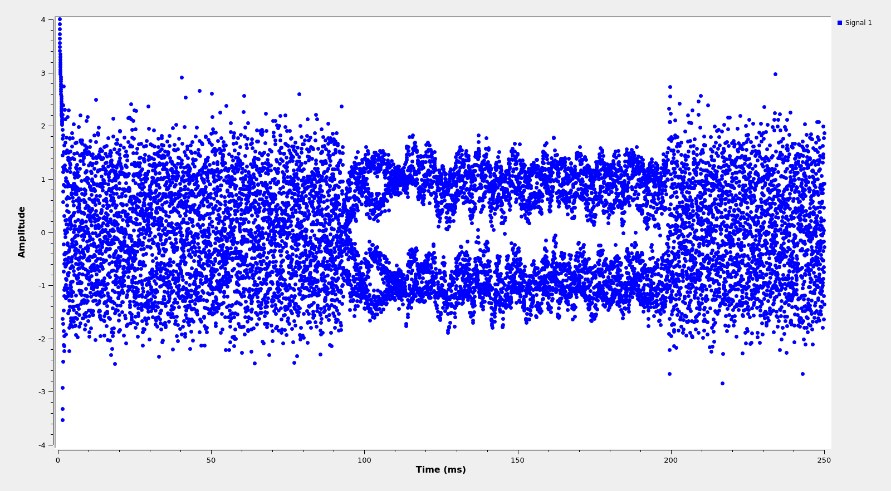

    Output of the FSK demodulator example flowgraph

The figure below shows the options allowed by the FSK demodulator block. The
Baudrate option is used to set the baudrate in symbols per second. The Sample
rate option specifies the sample rate of the input. The IQ input option enables
IQ (complex) input. The signal is expected to be centred at baseband (0Hz) when
IQ input is selected.
    

    Options of FSK demodulator

AFSK demodulator
""""""""""""""""

The APSK demodulator expects an input which consists of RF samples of an AFSK
signal, and outputs the demodulated AFSK soft symbols.  Both real and IQ (complex)
input are suported, but the semantics are different: with real input, the AFSK
demodulator expects an FM-demodulated signal; with IQ input, the AFSK demodulator
expects the signal before FM demodulation (see :ref:`FSK demodulation and IQ input`).

The figure below shows the example flowgraph which can be found in
``examples/components/afsk_demodulator.grc``. This reads a WAV file from
:ref:`satellite-recordings<Downloading sample recordings>` which contains a
single AFSK packet from GOMX-1 and uses the AFSK demodulator to obtain the
symbols. The "Head" block is used to select a portion of the output, which
is then plotted using the "QT GUI Time Sink".

.. figure:: images/afsk_demodulator_flowgraph.png
    :alt: Usage of AFSK demodulator in a flowgraph

    Usage of AFSK demodulator in a flowgraph

When this example flowgraph is run, it displays the output shown in the figure
below. There we can see the AFSK packet, surrounded by noise on both sides.
    
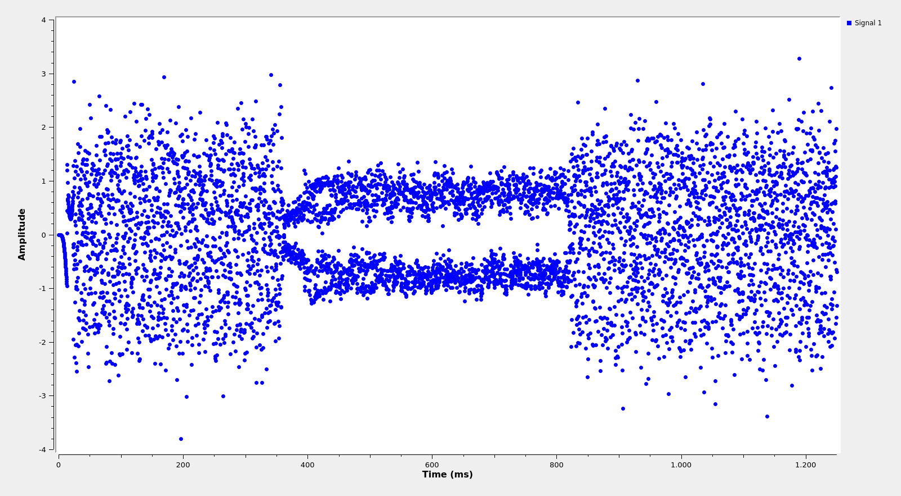

    Output of the AFSK demodulator example flowgraph

The figure below shows the options allowed by the AFSK demodulator block. The
Baudrate option is used to set the baudrate in symbols per second. The Sample
rate option specifies the sample rate of the input.

The AF carrier option specifies the audio frequency in Hz on which the FSK tones
are centred. The Deviation option specifies the separation in Hz between each
of the tones and the AF carrier. If the deviation is positive, the high tone is
interpreted as representing the symbol 1, while the low tone is interpreted as
representing the symbol 0 (or -1 in bipolar representation). If the deviation is
negative, the low tone is interpreted as representing the symbol 1 and the high
tone is interpreted as representing the symbol 0.

In this example, the AF carrier is 3600 Hz and the deviation is -1200 Hz. This
means that the tone representing 1 is at 2400 Hz, while the tone representing 0
is at 4800 Hz (the signal is actually 4800 baud GMSK).

The IQ input option enables IQ (complex) input.
    
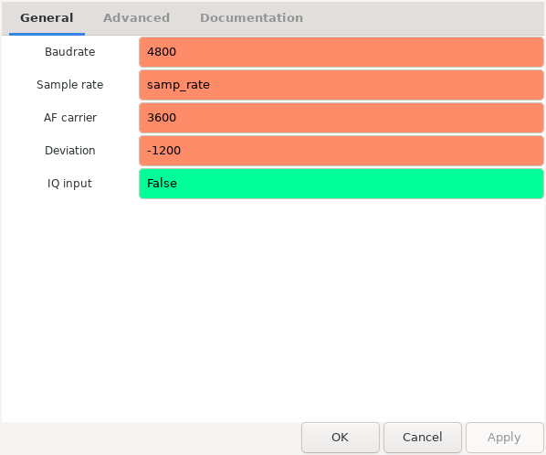

    Options of AFSK demodulator

Deframers
^^^^^^^^^

Deframer components can be found under *Satellites > Deframers* in GNU
Radio companion. There is a large number of deframer component blocks, since
many satellites use ad-hoc protocols for framing, so a custom deframer is used
for those satellites.

Deframers take soft symbols, produced as the output of one of the demodulator
components, and detect frame boundaries, perform as necessary descrambling,
deinterleaving, FEC decoding, CRC checking, etc.

Here, the most popular deframers are described. For ad-hoc deframers that are
used in few satellites, the reader is referred to the documentation of each of
the blocks in GNU Radio companion.

AX.25 deframer
""""""""""""""

The AX.25 deframer implements the `AX.25`_ protocol. It performs NRZ-I decoding,
frame boundary detection, bit de-stuffing, and CRC-16 checking. Optionally, it
can also perform G3RUH descrambling. G3RUH scrambling is typically used for
faster baudrates, such as 9k6 FSK packet radio, but not for slower baudrates,
such as 1k2 AFSK packet radio.

The figure below shows an example flowgraph of the AX.25 deframer block. This
example can be found in ``examples/components/ax25_deframer.grc``. The example
reads a WAV file from :ref:`satellite-recordings<Downloading sample recordings>`
containing 9k6 FSK AX.25 packets from US01, demodulates them
with the FSK demodulator block, deframes tham with AX.25 deframer, and prints
the output with the Message Debug block.

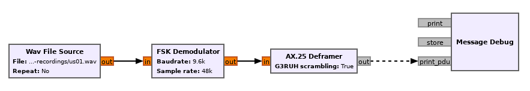

    Usage of AX.25 deframer in a flowgraph

The AX.25 deframer block has a single parameter that indicates whether G3RUH
descrambling should be performed or not.

GOMspace AX100 deframer
"""""""""""""""""""""""

The GOMspace AX100 deframer implements two different protocols used by the popular
`GOMspace NanoCom AX100`_ transceiver. These two protocols are:

* ASM+Golay. This uses a header encoded with a Golay(24,12) code that indicates
  the packet length. The payload is Reed-Solomon encoded with a (255,223) CCSDS
  code and scrambled with the CCSDS synchronous scrambler.

* Reed Solomon. This uses a G3RUH asynchronous scrambler. The first byte of the
  packets indicates the length of the payload and is sent unprotected. The
  packet payload is Reed-Solomon encoded with a (255,223) CCSDS code.

The figure below shows an example flowgraph of the AX100 deframer block running
in both modes. This example can be found in
``examples/components/ax100_deframer.grc``. For ASM+Golay decoding the example
reads a WAV file from :ref:`satellite-recordings<Downloading sample recordings>`
containing packets from 1KUNS-PF. For Reed Solomon decoding the
example reads a WAV file from
:ref:`satellite-recordings<Downloading sample recordings>`
which contains packets from TW-1B. The output frames are printed with Message
Debug blocks.
  
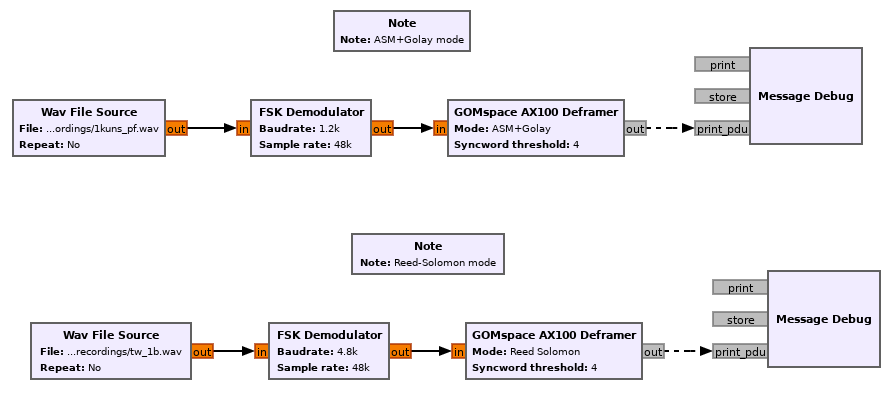

    Usage of AX100 deframer in a flowgraph

The AX100 deframer only has two parameters, the Mode parameter indicates the
mode, as described above, and the Syncword threshold parameters specifies how
many bit errors are allowed in the detection of the 32 bit syncword.

GOMspace U482C deframer
"""""""""""""""""""""""

The GOMsace U482C deframer implements the protocol used by the GOMspace NanoCom
U482C tranceiver, which is an older transceiver from GOMspace that is still seen
in some satellites.

The protocol used by the U482C is similar to the ASM+Golay mode used by the
AX100. The packet payload can be optionally:

* Encoded with the CCSDS r=1/2, k=7 convolutional encoder

* Scrambled with the CCSDS synchronous scrambler

* Encoded with a CCSDS (255,223) Reed-Solomon code

The packet header has flags that indicate which of this options are in use, in
addition to the length field.

The U482C modem uses AFSK with a 4800 baud audio-frequency GMSK waveform.

The figure below shows an example flowgraph of the U482C deframer block. This
example can be found in ``examples/components/u482c_deframer.grc``. The example
reads a WAV file from :ref:`satellite-recordings<Downloading sample recordings>`
containing a packet from GOMX-1. The packet is demodulated and deframed, and the
output is printed in hex using the Message Debug block.

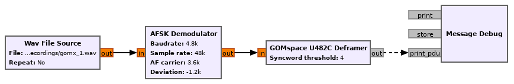

    Usage of U482C deframer in a flowgraph

The U482C deframer has a single parameter, which indicates the number of bit
errors that are allowed in the syncword detection.

AO-40 FEC deframer
""""""""""""""""""

The AO-40 FEC deframer implements the protocol designed by Phil Karn KA9Q for
the `AO-40 FEC beacon`_. This protocol is currently used in the FUNcube
satellites and others.

The FEC is based on CCSDS recommendations and uses a pair of interleaved
Reed-Solomon (160,128) codes, the CCSDS synchronous scrambler, the CCSDS r=1/2,
k=7 convolutional code, interleaving and a distributed syncword.

The figure below shows an example flowgraph of the AO-40 FEC deframer
block. This example can be found in
``examples/components/ao40_fec_deframer.grc``. It reads a WAV file from
:ref:`satellite-recordings<Downloading sample recordings>` containing a packet
from AO-73 (FUNcube-1). The packet is first BPSK demodulated and then deframed
with the AO-40 FEC deframer. The output is printed out using the Message
Debug block.

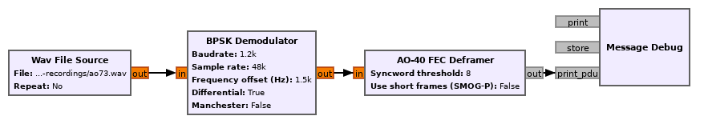

    Usage of AO-40 FEC deframer in a flowgraph

The AO-40 FEC deframer blocks has two parameters. The Syncword threshold
parameter indicates the number of bit errors to allow in the syncword
detection. The Use short frames parameter toggles the usage of short
frames. This is a variant of the AO-40 FEC protocol which is based on a single
Reed-Solomon codeword and is used by SMOG-P and ATL-1.

CCSDS deframers
"""""""""""""""

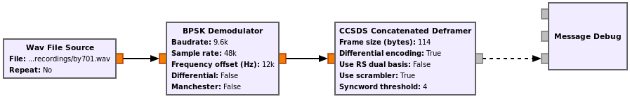

    Usage of CCSDS Concatenated deframer in a flowgraph

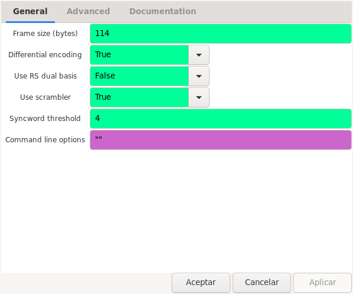

    Options of CCSDS Concatenated deframer

Transports
^^^^^^^^^^

Data sinks
^^^^^^^^^^

.. _AX.25: http://www.ax25.net/
.. _GOMspace NanoCom AX100: https://gomspace.com/shop/subsystems/communication-systems/nanocom-ax100.aspx
.. _AO-40 FEC beacon: http://www.ka9q.net/papers/ao40tlm.html
