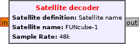

Overview
========

gr-satellites can be used in different ways depending on the experience of the
user and the desired degree of customization. This section gives an overview of
the possibilities.

Command line tool
^^^^^^^^^^^^^^^^^

The main way of using gr-satellites is through the ``gr_satellites`` command
line tool. This allows users users to decode the satellites officially supported
by gr-satellites by using a command line tool. Decoding options can be
specified as command line parameters. The tool supports processing both RF samples
streamed in real-time from an SDR receiver or a conventional radio connected to
the computer's soundcard, and recordings in different formats.

The command line tool is the most simple way of using gr-satellites and so it is
recommended as the starting point for beginners. The usage of this tool is
described in depth in the :ref:`gr_satellites command line tool` section.

Satellite decoder block
^^^^^^^^^^^^^^^^^^^^^^^

The Satellite decoder block gives most of the functionality of the ``gr_satellites``
command line tool encapsulated as a GNU Radio block.

    Satellite decoder GNU Radio block

It can be included in any kind of `GNU Radio Companion`_ flowgraphs and it can
be used to achieve a greater degree of customization and flexiblity than what it
is possible with the command line tool.

The input to the Satellite decoder block may be pre-processed freely using GNU
Radio blocks. The decoded frames are output as PDUs and can be handled in any
manner by the user's flowgraph.

The Satellite decoder block is recommended for users who are already familiar
with the command line tool and want a higher degree of customization. Its usage
is described in the :ref:`Satellite decoder block` section.

.. _GNU Radio Companion: https://wiki.gnuradio.org/index.php/Guided_Tutorial_GRC

Components
^^^^^^^^^^

Components are the high level blocks in which gr-satellites is
structured. Briefly speaking, the decoding chain is split into different tasks
and the ``gr_satellites`` command line tool and Satellite decoder block perform
decoding by selecting and connecting the appropriate components for each of these
tasks depending on the satellite selected by the user.

The architecture of components is described in more detail in the
:ref:`Components` section. They can be used as GNU Radio Companion blocks to
customize decoders further than what is allowed by the Satellite decoder
block. Additionally, they can be useful to build receivers for other RF
communication protocols.

Users interesting in learning how the decoding process works or in adding new
decoders to gr-satellites should be familiar with components.

Low level blocks
^^^^^^^^^^^^^^^^

Finally, gr-satellites has a large number of lower level GNU Radio Companion
blocks that may be useful in many different situations. Usage of these low level
blocks is recommended only for users already familiar with gr-satellites or GNU
Radio.

Utilities
^^^^^^^^^

Besides the ``gr_satellites`` command line tool and the GNU Radio blocks,
gr-satellites also contains a few :ref:`Miscellaneous utilities` that can be
used with some of the satellites.
