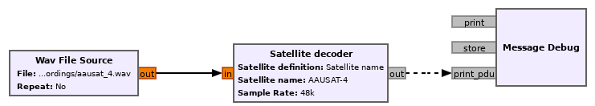
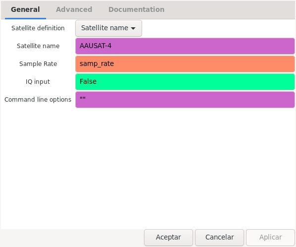

.. _Satellite decoder block:

Satellite decoder block
=======================

The Satellite decoder block brings most of the functionality of the
``gr_satellites`` command line tool in the form of a GNU Radio block. This
allows the experienced user to leverage the functionality of the satellite
decoders in their own designs or to achieve a greater degree of customization
than what is possible with the command line tool.

The input of the Satellite decoder block is a stream of samples, which can be
either real or complex, for IQ input (see :ref:`Real or IQ input`). The output
of the block is PDUs with the decoded frames. The figure below shows a very
basic use of the Satellite decoder block, where the input is taken from a WAV
recording using the Wav File Source block and the output is printed using the
Message Debug block. This example can be found in gr-satellites in
``examples/satellite_decoder/satellite_decoder.grc``.

    Usage of Satellite decoder in a flowgraph

The figure below shows the options for the Satellite decoder block. It is
possible to specify the satellite to use in the same ways as for the
``gr_satellites`` command line tool (see :ref:`Specifying the satellite`). The
method to specify the satellite is chosen in the *Satellite definition*
dropdown menu. The sample rate needs to be entered in the *Sample Rate* field,
and the *IQ input* field selects real or IQ input. The *Command line options*
field is described below.
    

    Options of Satellite decoder

Here are a few ideas of how the Satellite decoder block can be employed by
users to build custom decoders which are not possible with the command line
tool.

On the input side, it is possible to use all the standard GNU Radio blocks to
support a large number of SDR hardware and recording formats. The different
channeliser and filter blocks (especially "Frequency Xlating FIR Filter") can be
used to adapt the sample rate and bandwidth of the signal into something useful
for the satellite decoder. For example, a wideband SDR might be used to receive
the signal of different satellites, performing Doppler correction with
`gr-gpredict-doppler`_. The signals of these satellites might be channelised with
a "Frequency Xlating FIR Filter" blocks and fed into independent Satellite
decoder blocks.

On the output side, it is possible to treat the received PDUs freely. This
allows classifying and storing them in different ways. Upper layer complex
protocols might be completely handled inside the GNU Radio flowgraph, provided
there is a suitable implementation of these protocols. Additionally, it is
possible to interface the decoder to external tools with default GNU Radio
blocks, by using TCP sockets or ZeroMQ.

.. _Command line options:

Command line options
^^^^^^^^^^^^^^^^^^^^

The satellite decoder block allows entering the same kind of command line
options supported by the ``gr_satellites`` command line tool into the *Command
line options* parameter of the block. The set of options to use needs to be
specified as a Python script. To see the available optioins, it is possible to
use ``"--help"`` as the options, just as one would do when using a command line
tool. When the flowgraph is run, it will print out the allowable options and
stop. In the same manner, if invalid options are specified, when the flowgraph
is run it will print the correct usage and stop.

.. _gr-gpredict-doppler: https://github.com/ghostop14/gr-gpredict-doppler
